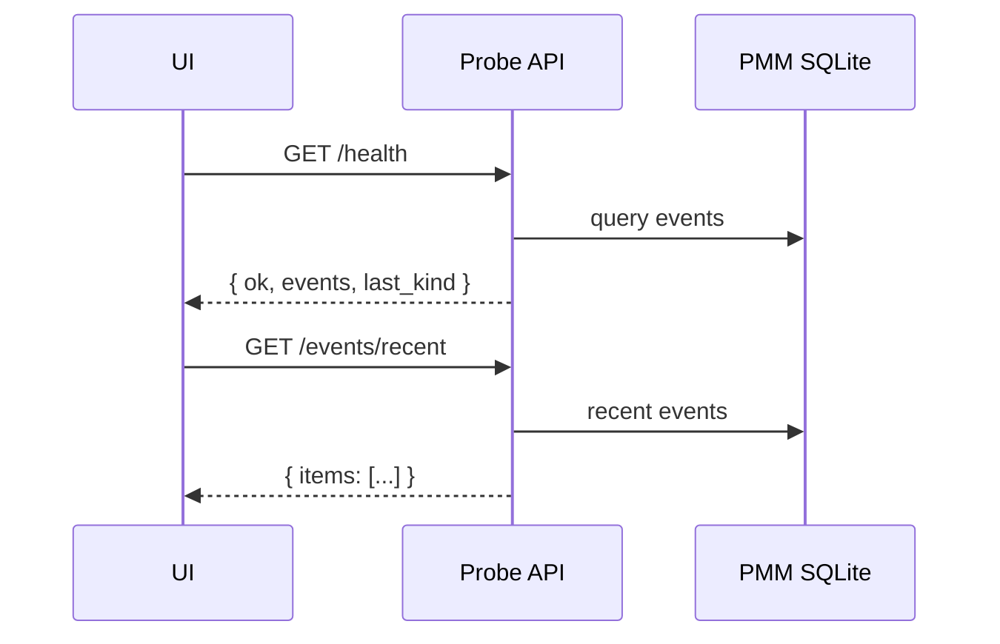

# UI Data Flow

```mermaid
sequenceDiagram
  participant UI
  participant API as Probe API
  participant DB as PMM SQLite

  UI->>API: GET /health
  API->>DB: query events
  API-->>UI: { ok, events, last_kind }

  UI->>API: GET /events/recent
  API->>DB: recent events
  API-->>UI: { items: [...] }
```
